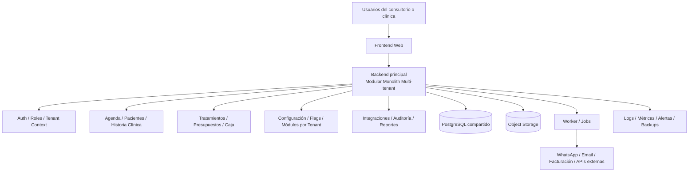
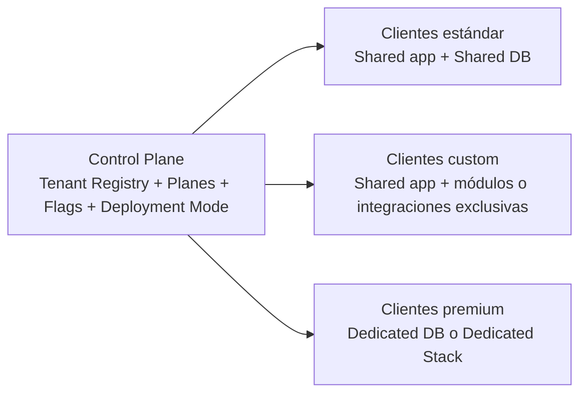
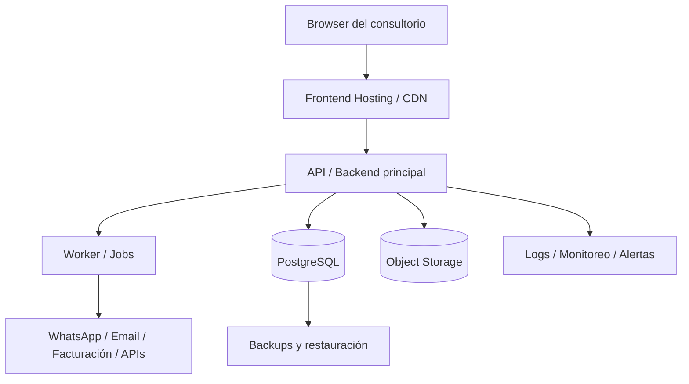

# Arquitectura de alto nivel e infraestructura inicial para SaaS odontológico

**Fecha:** 2026-03-30  
**Estado:** diseño validado a nivel dirección general  
**Objetivo:** definir una arquitectura de producto e infraestructura que permita lanzar un SaaS odontológico repetible para consultorios individuales y clínicas chicas, sin cerrar la puerta a customizaciones exclusivas ni a clientes premium más aislados.

---

## 1. Resumen ejecutivo

La recomendación es **NO** crear una VPS por cliente desde el día 1.

La arquitectura sugerida es:

- **SaaS multi-tenant como base**
- **backend tipo modular monolith**
- **infraestructura compartida para la mayoría de clientes**
- **capas de configuración, feature flags y módulos activables por tenant**
- **capacidad de migrar algunos clientes a mayor aislamiento** cuando exista una razón comercial o técnica real

En otras palabras:

> empezar simple para operar bien, pero diseñar la salida hacia aislamiento premium sin rehacer el sistema.

---

## 2. Decisión recomendada

### 2.1 Modelo de producto

El producto debe pensarse como un **SaaS repetible**, no como software factory por cliente.

Las customizaciones deben ser una **excepción controlada y monetizable**, no el modelo principal del negocio.

### 2.2 Modelo de tenancy

Se recomienda un enfoque **híbrido**:

1. **Clientes estándar**
   - comparten la misma plataforma
   - comparten el mismo despliegue
   - comparten la misma base de aplicación
   - sus datos se separan por tenant

2. **Clientes con necesidades especiales**
   - pueden tener módulos exclusivos
   - pueden tener integraciones exclusivas
   - pueden tener reglas o workflows exclusivos

3. **Clientes premium o sensibles**
   - pueden migrarse a **base dedicada**
   - y, sólo si vale la pena, a **instancia dedicada**

### 2.3 Regla principal

Antes de crear infraestructura dedicada por cliente, intentar resolver las necesidades en este orden:

1. configuración por tenant
2. feature flags por tenant
3. módulo opcional por tenant
4. integración/adaptador por tenant
5. regla o workflow por tenant
6. base dedicada
7. stack dedicado
8. fork de código por cliente (**evitarlo todo lo posible**)

---

## 3. Principios arquitectónicos

### 3.1 Modular monolith primero

Para la etapa inicial, la mejor decisión es un **modular monolith** en lugar de microservicios.

Motivos:

- menor complejidad operativa
- menor costo de infraestructura
- más velocidad para iterar producto
- más facilidad para testear y desplegar
- más simple mantener consistencia en un dominio que todavía está madurando

La división en módulos debe existir desde el inicio, aunque corra dentro de una sola aplicación.

### 3.2 Multi-tenant by design

El sistema debe nacer con conciencia de tenant:

- cada request resuelve el `tenant_id`
- cada dato de negocio relevante queda asociado a un tenant
- toda consulta de dominio se filtra por tenant
- archivos, jobs, integraciones y logs deben poder rastrearse por tenant

### 3.3 Customizaciones aisladas del core

La forma correcta de crecer no es meter `if cliente_x` en todo el sistema.

La forma correcta es:

- core estable
- puntos de extensión explícitos
- módulos activables por tenant
- adaptadores externos desacoplados
- contratos claros entre core y extensiones

---

## 4. Arquitectura lógica recomendada

### 4.1 Componentes principales

1. **Frontend web**
   - app web para recepcionista, odontólogo, admin y dueño de clínica
   - idealmente SPA o app web moderna

2. **Backend principal**
   - API + lógica de negocio
   - modular monolith
   - responsable de auth, autorización, reglas de negocio y exposición de endpoints

3. **Worker / jobs**
   - envío de recordatorios
   - tareas asíncronas
   - integraciones con terceros
   - generación de PDFs/reportes

4. **Base de datos transaccional**
   - PostgreSQL
   - compartida al inicio para la mayoría de tenants

5. **Almacenamiento de archivos**
   - imágenes, adjuntos clínicos, PDFs, exportaciones
   - separación por prefijo o bucket path de tenant

6. **Capa de configuración por tenant**
   - plan
   - módulos activos
   - flags
   - branding
   - integraciones habilitadas
   - modo de despliegue (`shared`, `dedicated-db`, `dedicated-stack`)

7. **Integraciones externas**
   - WhatsApp / email / SMS
   - facturación
   - AFIP/ARCA u otras integraciones locales
   - laboratorios o servicios externos futuros

8. **Observabilidad y operación**
   - logs
   - métricas
   - alertas
   - backups

### 4.2 Módulos iniciales sugeridos

El backend debería separarse, al menos, en estos módulos:

- Auth / usuarios / roles
- Tenants / planes / configuración
- Pacientes
- Historia clínica / odontograma
- Agenda / turnos
- Presupuestos / tratamientos
- Caja / cobranzas / cuentas corrientes
- Comunicación / recordatorios
- Reportes
- Integraciones
- Auditoría / trazabilidad

---

## 5. Diagrama de arquitectura lógica

---

## 6. Modelo de tenancy recomendado

### 6.1 Fase inicial: pooled multi-tenancy

Para los primeros clientes, la mejor relación costo/beneficio es:

- **una sola app**
- **una sola infraestructura principal**
- **una base compartida**
- separación por `tenant_id`

Esto te permite:

- lanzar rápido
- administrar poco
- mantener una única versión del producto
- reducir costos fijos

### 6.2 Preparación para tenants premium

Aunque arranques pooled, el diseño debe dejar abierta una evolución a:

- **dedicated-db tenant**: mismo producto, base separada
- **dedicated-stack tenant**: despliegue completo separado

La clave para eso es una **tabla o registro maestro de tenants** que diga:

- tenant
- plan
- módulos activos
- integraciones activas
- tipo de despliegue
- ubicación de sus datos

### 6.3 Qué no hacer

No conviene empezar con una VPS por cliente para todos porque:

- multiplica deploys
- multiplica monitoreo
- multiplica backups
- multiplica incidentes operativos
- te desacelera cada release
- te acerca más a una operación de consultoría que a un SaaS

---

## 7. Diagrama de evolución de tenancy

---

## 8. Estrategia de customización

### 8.1 Lo más sano para el negocio

Si un cliente necesita algo especial, la arquitectura debería permitir venderlo sin romper el producto.

La estrategia recomendada es:

#### Nivel 1: configuración
- plantillas
- branding
- permisos
- parámetros funcionales

#### Nivel 2: módulos opcionales
- funcionalidades que se activan o no por tenant

#### Nivel 3: integraciones específicas
- conectores a servicios externos propios del cliente o de su operación

#### Nivel 4: workflows específicos
- reglas de negocio adicionales encapsuladas

#### Nivel 5: aislamiento premium
- base dedicada o stack dedicado si el caso lo amerita

### 8.2 Qué evitar

Evitar que las customizaciones se conviertan en:

- condicionales esparcidos por todo el core
- ramas de código distintas por cliente
- forks permanentes
- despliegues manuales sin contratos claros

### 8.3 Regla de arquitectura para customizaciones

Una customización exclusiva debe vivir en una de estas formas:

- configuración
- módulo opcional
- adaptador/integración
- extensión acotada sobre una interfaz estable

Si para resolver algo tenés que tocar el core en 15 lugares, la arquitectura está mal delimitada.

---

## 9. Datos y aislamiento

### 9.1 Recomendación inicial

Usar PostgreSQL como base principal.

Convenciones mínimas:

- todas las tablas de negocio relevantes incluyen `tenant_id`
- índices compuestos con `tenant_id` cuando corresponda
- auditoría de acciones sensibles
- separación clara entre tablas globales y tablas tenant-scoped

### 9.2 Tipos de datos

**Globales**
- catálogo del sistema
- planes
- definición de módulos
- metadatos de despliegue

**Por tenant**
- pacientes
- historias clínicas
- turnos
- tratamientos
- cobranzas
- configuraciones operativas
- documentos

### 9.3 Recomendación importante

No mezclar el conocimiento del tenant “a mano” en cada pantalla o query improvisada.

Debe existir un **Tenant Context** bien definido que viaje por backend, jobs, auditoría y almacenamiento.

---

## 10. Infraestructura inicial recomendada

### 10.1 Stack mínimo sano

La infraestructura inicial más razonable para este caso es:

- **Frontend** en hosting estático/CDN
- **Backend principal** en contenedor único o servicio app principal
- **Worker** como proceso separado usando la misma codebase
- **PostgreSQL** preferentemente gestionado
- **Object storage** para archivos clínicos y PDFs
- **servicio de monitoreo y alertas**
- **backups automáticos**

### 10.2 Recomendación operativa

Si el presupuesto es limitado, la opción razonable es:

- **una sola infraestructura compartida para la app**
- **no una VPS por cliente**
- y, si se puede, **DB gestionada** antes que DB autoadministrada

Porque el dato clínico y administrativo es demasiado importante como para subestimar backups, restauración y observabilidad.

### 10.3 Separación útil desde el inicio

Aunque el sistema sea chico, conviene separar:

- **producción**
- **staging o entorno de pruebas**

No hace falta una plataforma enterprise, pero sí evitar tocar producción a ciegas.

---

## 11. Diagrama de infraestructura sugerida

---

## 12. Camino de evolución sugerido

### Etapa 1: 1 a 10 clientes

- modular monolith
- shared app
- shared DB
- tenant_id bien implementado
- módulos y flags por tenant
- observabilidad básica

### Etapa 2: validación comercial

- mejor separación entre app y worker
- control plane más explícito
- integraciones por tenant más robustas
- políticas de auditoría y permisos más finas

### Etapa 3: tenants premium

- algunos tenants migran a base dedicada
- algunos tenants pueden tener despliegue dedicado
- el core sigue siendo uno
- la operación premium se vende como upgrade, no como norma

### Etapa 4: escala mayor

Recién cuando el producto y el volumen lo justifiquen, evaluar:

- particionar componentes
- extraer servicios específicos
- aislar cargas pesadas
- mover partes concretas fuera del monolito

No antes.

---

## 13. Anti-patrones a evitar

- una VPS por cliente desde el inicio sin necesidad real
- microservicios prematuros
- customizaciones metidas en el core con `if cliente`
- forks por cliente
- falta de tenant awareness en datos, logs y jobs
- guardar todo en una sola máquina sin estrategia de backup

---

## 14. Conclusión final

La mejor decisión para este caso es:

> **arrancar con un SaaS multi-tenant compartido, usando un modular monolith, y diseñar desde el inicio la capacidad de activar módulos, integraciones y aislamiento premium por tenant.**

Esto equilibra:

- simplicidad operativa
- costo razonable
- repetibilidad comercial
- posibilidad real de personalización paga
- y escalabilidad futura sin rehacer toda la base del sistema

La infraestructura dedicada por cliente debe ser una **excepción comercial premium**, no la arquitectura base del negocio.
